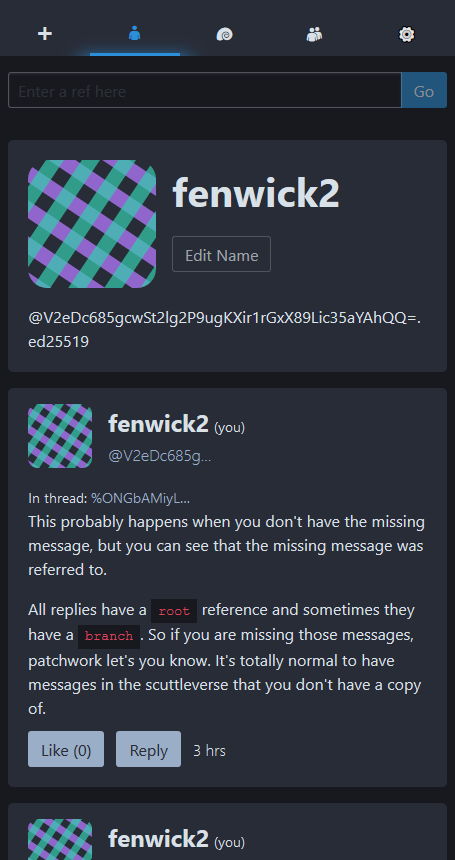
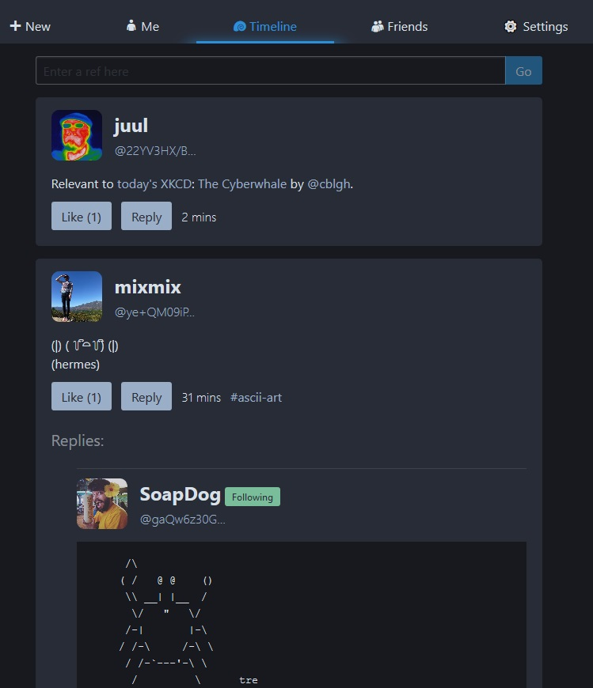

# Self-hosted SSB

(NOTE: THIS IS SLOW AND BAD, IT IS NOT MAINTAINED AND IS MOSTLY A PROOF OF CONCEPT)

A functioning, single-user, self-hosted Secure Scuttlebutt web server!




# What you can do

* Join pubs
* Look at the chronological timeline
* Make posts, replies and likes
* Make friends
* View your friends' posts
* View a thread, topic, user, channel, or attachment

# What you can't do

* Anything offline
* Anything terribly quickly
* Upload images
* Subscribe to anything
* Receive/send PMs
* Change your description or image
* Change other people's names or descriptions or images

# Installation

1. [Install Scuttlebot](https://ssbc.github.io/docs/scuttlebot/install.html)  and run it at least once to make sure it works
2. `git clone https://github.com/fenwick67/ssb-web.git`
3. `cd ssb-web`
4. `npm install`

# Usage 

## Local machine

1. `node index.js`
2. Go to `localhost:8080` to see!
3. GOTO THEN ⤵⤵⤵

## Server

1. `node index.js --imagedomain http://domain.name.or.ip:8081`
2. Go to `http://domain.name.or.ip:8080` to see!
3. GOTO THEN ⤵⤵⤵

## THEN

It should be running!  To start scuttling...

4. Try and log in
5. Look in the console output for what the default password is
6. Attempt to log in with the correct password
7. Add a pub invite via the Settings tab (watch the console to see if it actually worked)
8. Change your password as Scuttlebot builds the initial indexes.  It might be a few minutes.

# CLI Options

```
port           => set which port the main server should listen on 
imageport      => set which port the image server should listen on
imagedomain    => set the domain name that the images will be found on
                      format it like this (include the port and protocol): 
                      https://domain.name.or.ip:8081
```

You can also set these as environment variables if you use ALLCAPS.

The defaults are...

```
PORT=8080
IMAGEPORT=8081
IMAGEDOMAIN=http://localhost:8081
```

# Nerd Notes

Images and other blobs are served on a separate port to prevent any malicious stuff from being able to read your `localStorage` (where your JWT is stored).

If you change your password, your old sessions will be invalidated on the next start.

**Set up HTTPS please**, only run the HTTP stuff behind a HTTPS reverse proxy like NGINX.

Example nginx configs for your reference that might work:

```
# the main server
server {
    listen   443; 
    server_name your.public.url;

    ssl_certificate     your.crt;
    ssl_certificate_key your.key;
    ssl_protocols       TLSv1 TLSv1.1 TLSv1.2;
    ssl_ciphers         HIGH:!aNULL:!MD5;

    location / {
        proxy_pass http://127.0.0.1:8080;
    }
}

# used for assets
server {
    listen   6060; 
    server_name your.public.url;

    ssl_certificate     your.crt;
    ssl_certificate_key your.key;
    ssl_protocols       TLSv1 TLSv1.1 TLSv1.2;
    ssl_ciphers         HIGH:!aNULL:!MD5;

    location / {
        proxy_pass http://127.0.0.1:8081;
    }
}
```
